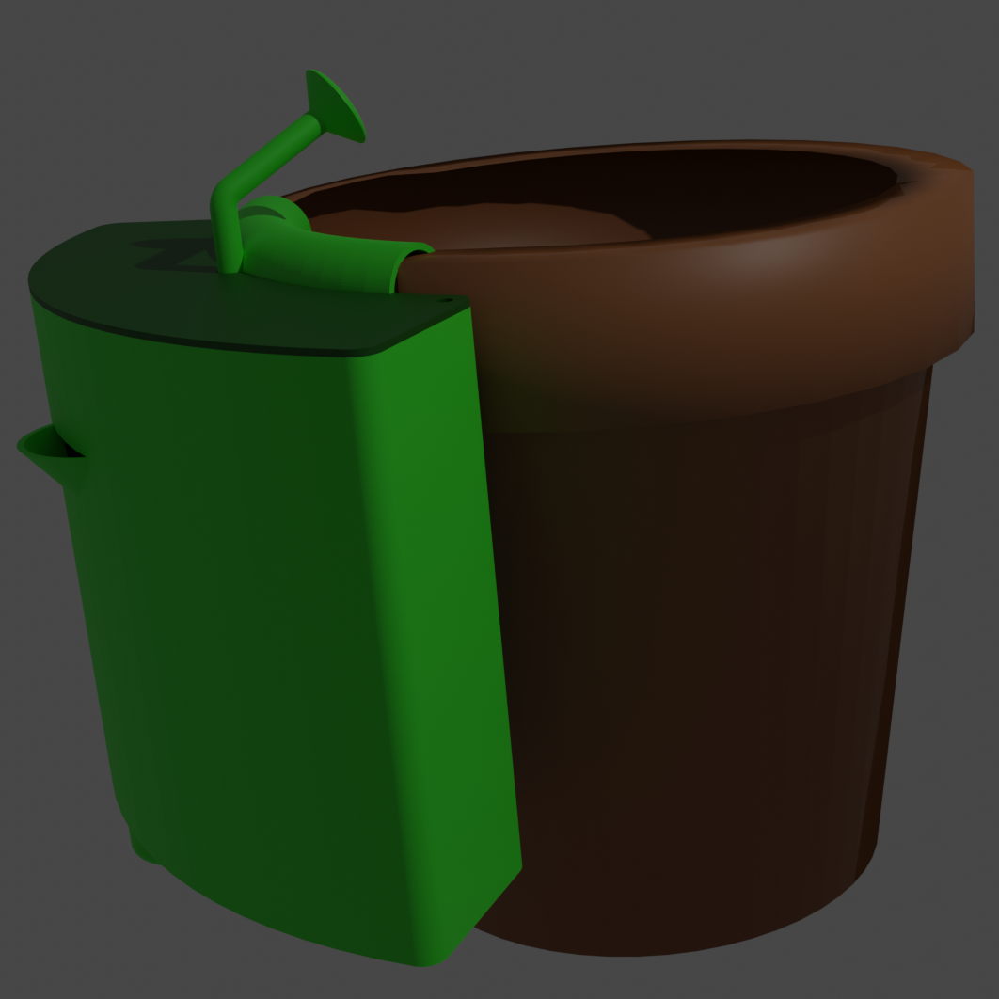
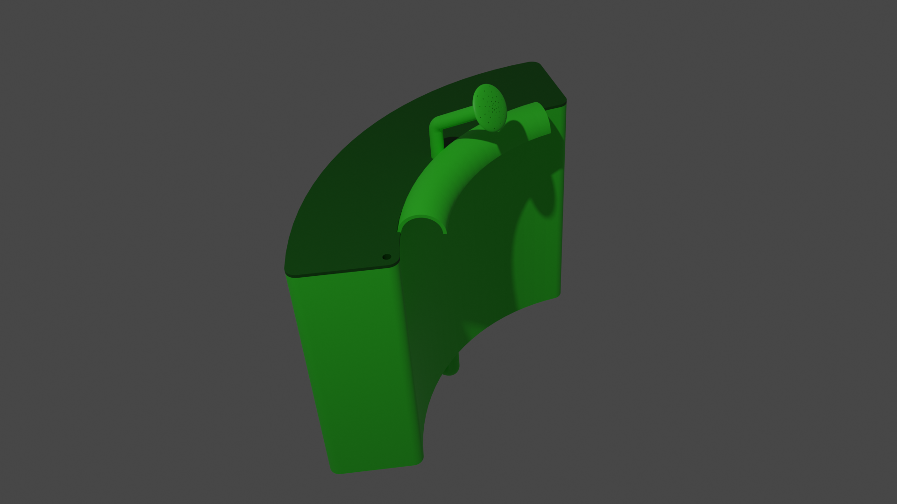
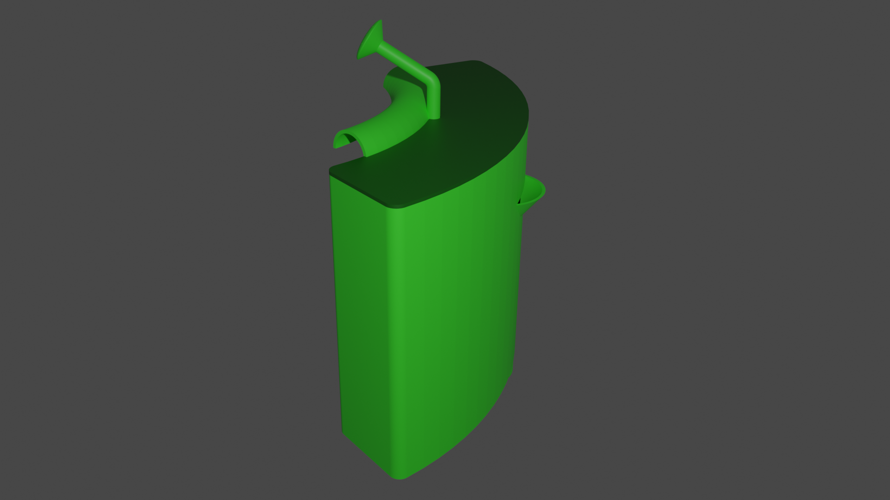
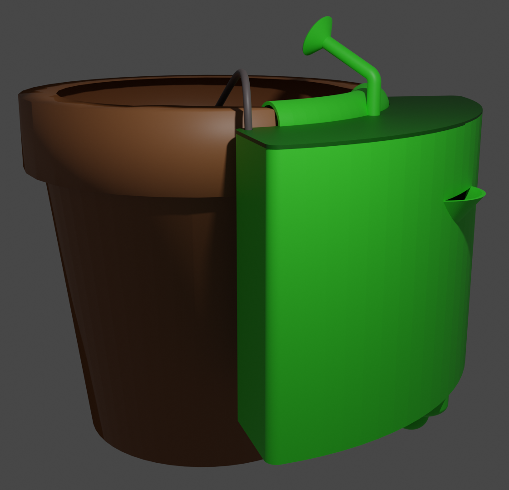

# Příručka pro použití zařízení _Zavlažovač kytek_

## Úvod
- Každému z nás už se jistě aspoň jednou stalo, že kytky zapomněl zalít a květina uschla.
- Přesně k tomu je tu _Zavlažovač kytek_, který hlídá vlhkost v půdě, v které je rostlina zasazena.

## Konstrukční řešení
- Zařízení je vyrobeno pomocí 3D tisku a dá se modifikovat pro určitý typ květináče
- Zařízení se dá snadno na květináč zavěsit a nemusí se k němu nic připojovat.
- Chod je bezúdržbový. jen je nutné doplňovat baterky do motoru a vodu do nádržky.

### Venkovní pohled

      

- Ze strany vyčuhuje trychtýř pro nalévání vody. Voda se pak plní do nádržky.
- Na horní straně je pak vidět konec konvice na zalévání, z které tato voda proudí do půdy.

### Vnitřní pohled

      

- Pod horním víkem se schovává technická část zařízení.
- Toto víko se dá snadno odšroubovat.
- Nachází se tam: 
  - přihrádka pro baterie pro jejich snadnou výměnu
  - Arduino pro řízení celého systému
  - do Arduina také vede kabel se senzory z květináče
  - motor, který pohání vrtuli

### Funkce motoru

      

- Motor, kterému dává signály Arduino, pohání vrtuli.
- Vrtule je na spodu nádržky na vodu a žene vodu trubicí, která vede pod nádržkou. 
- Díky podtlaku se tato voda dostane až do konvice na zalévání a voda se začne rozprašovat po povrchu půdy.

     

## Stručný popis fungování
- Pokud vlhkost v půdě klesne pod danou mez, [senzor vlhkosti](https://www.laskarduino.cz/arduino-senzor-vlhkosti-pudy/) vyšle signály do Arduina.
- Senzor dává logické signály 0 a 1 pro rozpoznání, jestli se má motor zapínat nebo ne.
- Arduino zapne motor, který je připojen na vrtuli.
- Vrtule se roztočí a žene vodu seměrem vzůhuru do konvice, která vodu rozmístí po povrchu půdy.
- Až bude vlhkost v půdě opět dobrá, senzory vlhkosti vyšlou signály Arduinu a to vypne motor.
- Vrtule se pak tedy točí do té doby, než je vlhkost v půdě opět v normálu.

## Instalace
- Po vybalení z krabice je nutno zařízení nainstalovat na okraj květináče.
- V nádobě je udělán malý otvor pro kabely na senzory. 
- To je znázorněno na obrázku:

     

- Senzory vlhkosti v půdě je nutno zapíchnout do půdy v oblasti kořenů.
- Pod krytem je místo pro baterie, které je nutno nainstalovat. (Baterie je nutné doplňovat!)
- Zkontrolujte funkčnost Arduina a motoru.
- Po zkontrolování všech součástek a správného zapojení je možné zařízení zapnout a do nádržky nalít vodu.
- Průběžně kontrolujte množství vody v nádržce a stav baterií

## Použití
- Zařízení se dá vytisknout na 3D tiskárně a je možno změnit si rozměry.
- Využít se dá u všech domácích rostlin.
- Je možno takové zařízení využít i ve velkých sklenících.

## Údržba
- Provoz je bezúdržbový.
- Je nutné průběžně kontrolovat stav vody v nádržce, stav baterií a celkový stav zařízení.
- V případě poruchy senzorů se dají tyto senozry snadno dokoupit. [Koupit senzor vlhkosti](https://www.laskarduino.cz/arduino-senzor-vlhkosti-pudy/)
