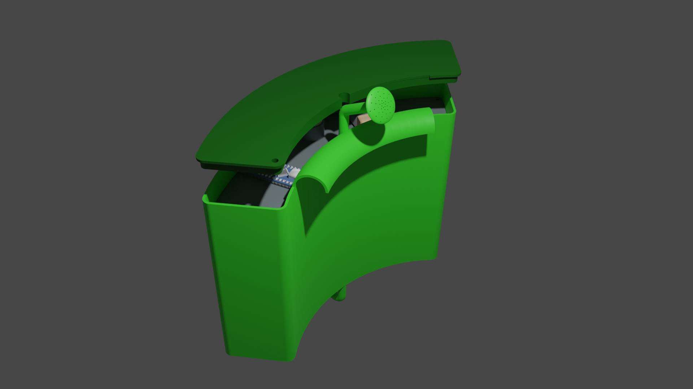
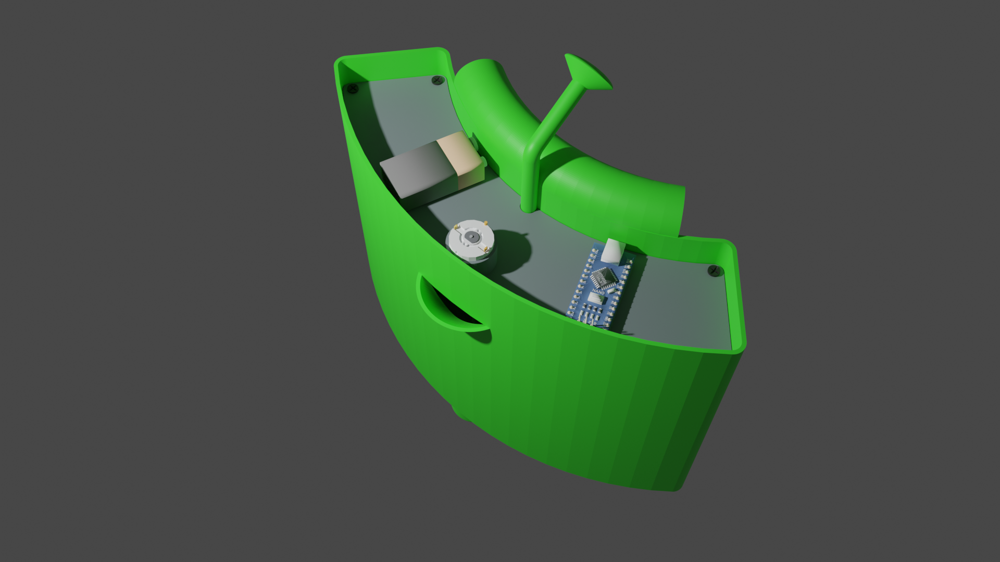
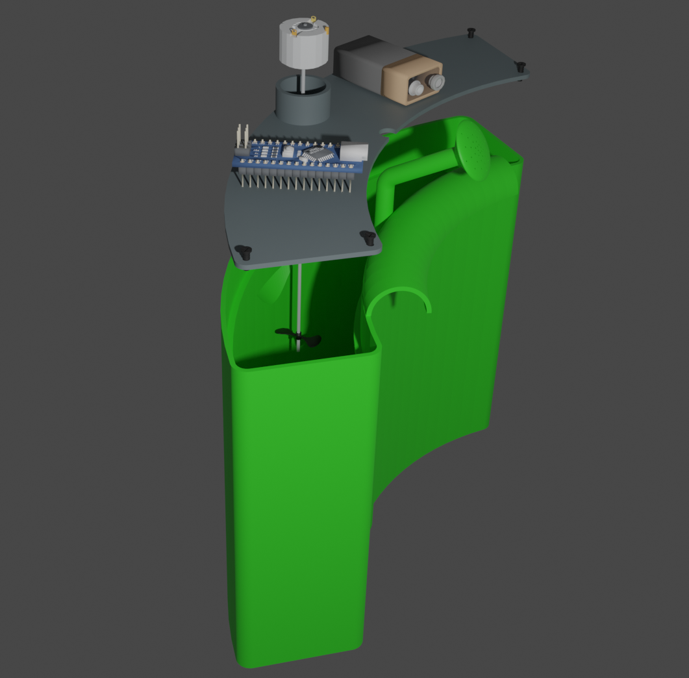
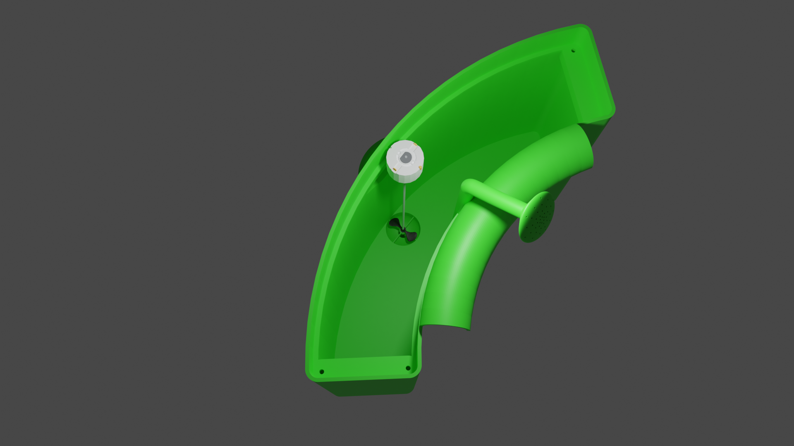
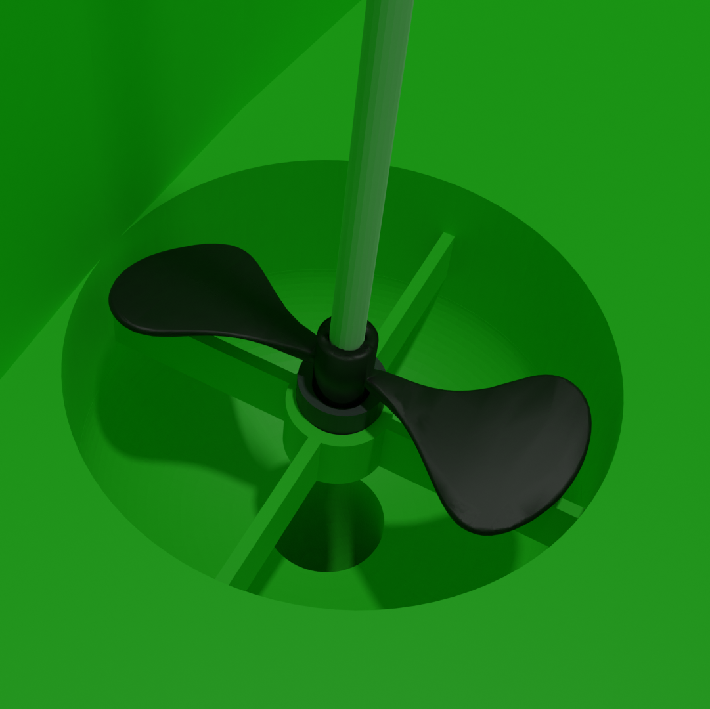
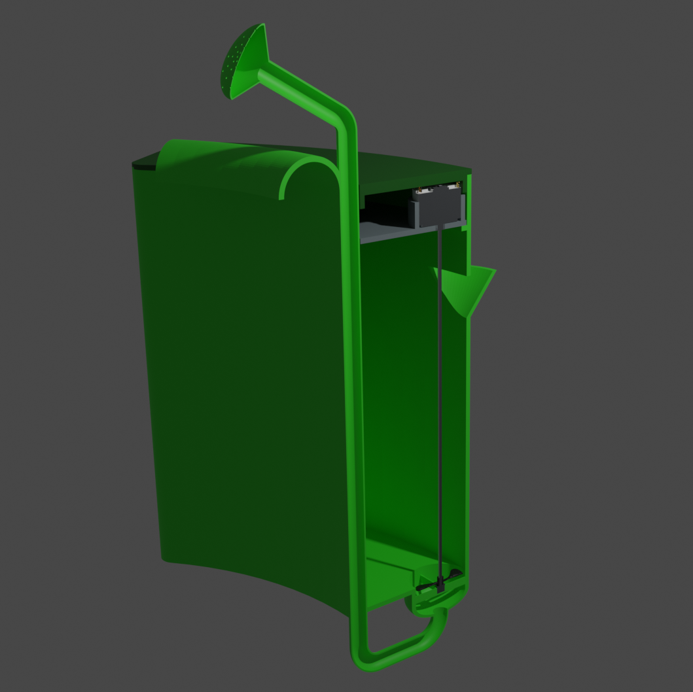
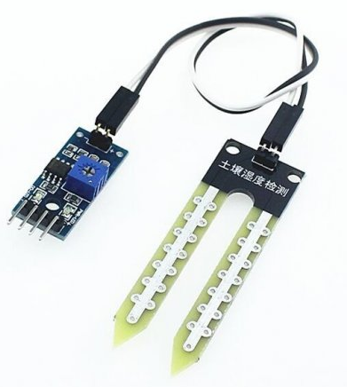

# Příručka pro popis funkce zařízení _Zavlažovač kytek_

## Konstrukční řešení

### Vnitřní pohled
<p align="center">
      
</p>

- Pod horním víkem se schovává technická část zařízení.
- Toto víko se dá snadno odšroubovat.
- Nachází se tam: 
  - přihrádka pro baterie pro jejich snadnou výměnu
  - Arduino pro řízení celého systému
  - do Arduina také vede kabel se senzory z květináče
  - motor, který pohání vrtuli

### Funkce motoru
<p align="center">
      
</p>

- Motor, kterému dává signály Arduino, pohání vrtuli.
- Vrtule je na spodu nádržky na vodu a žene vodu trubicí, která vede pod nádržkou. 
- Díky podtlaku se tato voda dostane až do konvice na zalévání a voda se začne rozprašovat po povrchu půdy.
<p align="center">
     
</p>

## Popis fungování
- Pokud vlhkost v půdě klesne pod danou mez, [senzor vlhkosti](https://www.laskarduino.cz/arduino-senzor-vlhkosti-pudy/) vyšle signály do Arduina.
- Senzor dává logické signály 0 a 1 pro rozpoznání, jestli se má motor zapínat nebo ne.
<p align="center">
     
</p>

- Arduino zapne motor, který je připojen na vrtuli.
- Vrtule se roztočí a žene vodu seměrem vzůhuru do konvice, která vodu rozmístí po povrchu půdy.
- Až bude vlhkost v půdě opět dobrá, senzory vlhkosti vyšlou signály Arduinu a to vypne motor.
- Vrtule se pak tedy točí do té doby, než je vlhkost v půdě opět v normálu.

## Zapojení motoru a Arudina

## Součástky

- 1x Arduino Uno
- 1x Motor
- 1x Potenciometr
- 1x Vlhkoměr (v tinkercadu nahradit fotorezistorem)
- 2x rezistor

## Zapojení

- Vlhkoměr - pokud je v půdě málo vlhkosti, spustí je zalévání.
- Potenciometr - možnost změnit rychlost motoru, a tím změnit množství vody za 1s.


## Kód do Arduina
```

void setup()
{
	pinMode(3, OUTPUT);
}


int delay_time = 500;
int min_humidity = 500;

void loop() {

	int humidity = analogRead(A0);

	if (humidity < min_humidity) {
		digitalWrite(3, HIGH);
	}
	else {
		digitalWrite(3, LOW);
	}

	delay(delay_time);
}

```

- Jak je vidět z kódu, pokud hladina vlhkosti (humidity) klesne pod danou mez, zapíše se na výstupu logická 1.
	- spustí to motor a ten začne pohánět vrtuli.
- V jiném případě (Hladina vlhkosti je dobrá) bude na výstupu logická 0.
	- pak se motor vypne.

```
if (humidity < min_humidity) {
		digitalWrite(3, HIGH);
	}
	else {
		digitalWrite(3, LOW);
	}
```
