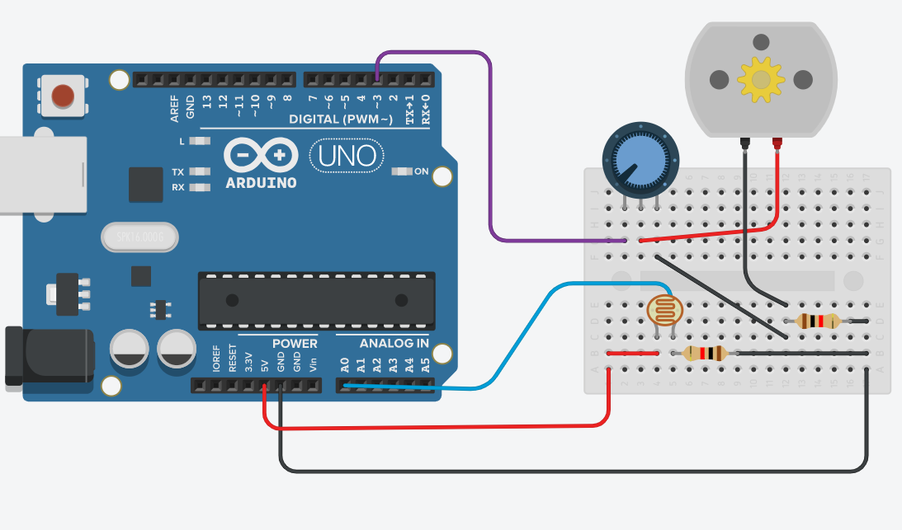

# Zapojení motoru v Tinkercadu

## Požadavky

- 1x Arduino Uno
- 1x Motor
- 1x Potenciometr
- 1x Vlhkoměr (v tinkercadu nahradit fotorezistorem)
- 2x rezistor

## Zapojení

- Vlhkoměr - pokud je v půdě málo vlhkosti, spustí je zalévání.
- Potenciometr - možnost změnit rychlost motoru, a tím změnit množství vody za 1s.



## Kód do Arduina
```

void setup()
{
	pinMode(3, OUTPUT);
}


int delay_time = 500;
int min_humidity = 500;

void loop() {

	int humidity = analogRead(A0);

	if (humidity < min_humidity) {
		digitalWrite(3, HIGH);
	}
	else {
		digitalWrite(3, LOW);
	}

	delay(delay_time);
}

```
